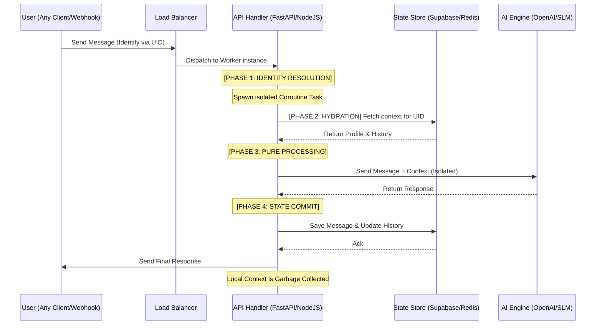

# Definitive Blueprint: Master-Class Stateless Request Isolation (SRI)

Stateless Request Isolation (SRI) is the definitive design pattern for building high-concurrency LLM applications. It ensures that even when 15,000 users are chatting at once, the system remains perfectly consistent, secure, and performant.

This document is a **Full-Code Implementation Guide**. After reading this, a developer will have every piece of knowledge required to build this system from scratch in a production environment.

---

## 1. The Core Philosophy: "The Server Has Dementia"
In an SRI architecture, the server is a pure processing pipe. It does not "remember" User A after the request is finished. 
- **User Identity**: Carried in the request (e.g., via a Phone Number or User ID).
- **User Context**: Externalized in a high-speed store (Database/Cache).
- **Server Execution**: Isolated in a sandboxed coroutine memory space.

---

## 2. Technical Architecture & Flow

### Detailed Sequence Diagram


---

## 3. Step-by-Step Implementation (The Full-Code Blueprint)

Follow this logic flow exactly. The use of `async` and `await` is non-negotiable for handling high concurrency.

### Step 1: The Request Model
Ensure the incoming data structure allows for strict identity filtering using a library like Pydantic.

```python
# FILE: models.py
from pydantic import BaseModel
from typing import Optional

class ChatRequest(BaseModel):
    user_id: str          # UNIQUE Identity (The key)
    message: str          # The input text
    session_id: Optional[str] = None
```

### Step 2: The Isolated Worker (API Entry Point)
This function must be a coroutine. In Python/FastAPI, this creates a new context for every request.

```python
# FILE: main.py
from fastapi import FastAPI, BackgroundTasks
from models import ChatRequest
from services import db_connector, ai_logic

app = FastAPI()

@app.post("/sakhi/chat")
async def handle_chat(req: ChatRequest):
    # --- PHASE 1: IDENTITY RESOLUTION ---
    # We resolve the unique ID immediately. 
    # This ID will be the 'anchor' for all following calls.
    uid = req.user_id
    
    # --- PHASE 2: CONTEXT HYDRATION ---
    # We fetch the specific user's history into LOCAL memory.
    # This variable lives ONLY in this request's call stack.
    history = await db_connector.get_recent_history(uid)
    profile = await db_connector.get_user_profile(uid)
    
    # --- PHASE 3: PURE PROCESSING ---
    # We pass the LOCAL variables to the AI logic.
    # The AI logic is a 'Pure Function' - output depends ONLY on these inputs.
    answer = await ai_logic.generate_response(
        text=req.message,
        user_name=profile.get("name"),
        chat_history=history
    )
    
    # --- PHASE 4: STATE COMMIT ---
    # Update the external diary (Database) before returning.
    await db_connector.save_interaction(uid, req.message, answer)
    
    # --- RETURN ---
    # Response is isolated to the socket that opened THIS request.
    return {"reply": answer}
```

### Step 3: The Data Connector (External State)
Every query MUST include the user ID filter to prevent cross-talk.

```python
# FILE: services/db_connector.py
from supabase_client import async_supabase_select, async_supabase_insert

async def get_recent_history(uid: str, limit: int = 5):
    # The filter 'user_id=eq.{uid}' is the wall that prevents a leak.
    messages = await async_supabase_select(
        "chat_messages", 
        select="content, role", 
        filters=f"user_id=eq.{uid}", 
        limit=limit
    )
    return messages

async def save_interaction(uid: str, user_text: str, bot_text: str):
    await async_supabase_insert("chat_messages", {
        "user_id": uid,
        "content": user_text,
        "role": "user"
    })
    await async_supabase_insert("chat_messages", {
        "user_id": uid,
        "content": bot_text,
        "role": "assistant"
    })
```

---

## 4. Solving Typical Implementation Doubts

### "How do I handle 10,000 concurrent LLM calls?"
**The Doubt**: Won't my server crash if 10k users call an LLM at once?
**The Solution**: SRI relies on **Non-Blocking I/O**. Your server is not "doing" the AI work; it is just *waiting* for it. Use a thread-safe HTTP library (like `httpx` or `axios`) with a connection pool. 
- Set `MAX_CONNECTIONS` to a high number (e.g., 500-1000).
- Local variables for 10,000 requests might take ~500MB of RAM, but the server won't "block" or crash.

### "What if the user clicks 'Send' 5 times in a second?"
**The Doubt**: Will this create 5 "Hydration" calls and mess up the history?
**The Solution**: Implement **Optimistic Locking** in your State Store. 
- Store a `last_processed_timestamp` for the user. 
- If Request #2 starts while Request #1 is in "Processing," return a `429 Too Many Requests` or use a Redis lock to force Request #2 to wait.

---

## 5. Security & Isolation Verification Checklist

1.  **Identity Test**: Can I send a message using User A's ID but User B's authentication token? (Middleware must prevent this).
2.  **Concurrency Stress-Test**: Use a tool like `locust` to send 100 simultaneous messages. Ensure the responses come back to the correct client every single time.
3.  **State Audit**: Does every record in your database have a `user_id`? If not, you have a "Shared State" vulnerability.

## 6. Portability Directive
This pattern is universal. Whether you use **Go Channels**, **Node.js Event Loop**, or **Python Asyncio**, the rule is the same: 
> **Never store user data in a global variable. Period.**

If you follow the **I-H-P-C** lifecycle within an **Isolated Async Context**, your system will be concurrent-ready by default.
